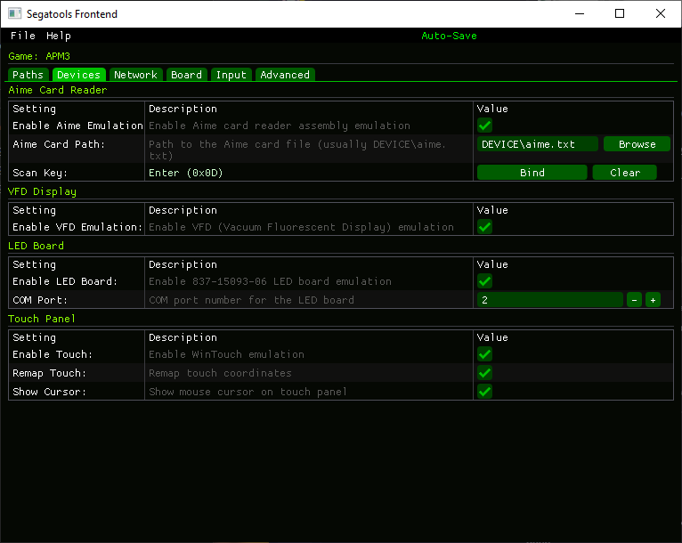
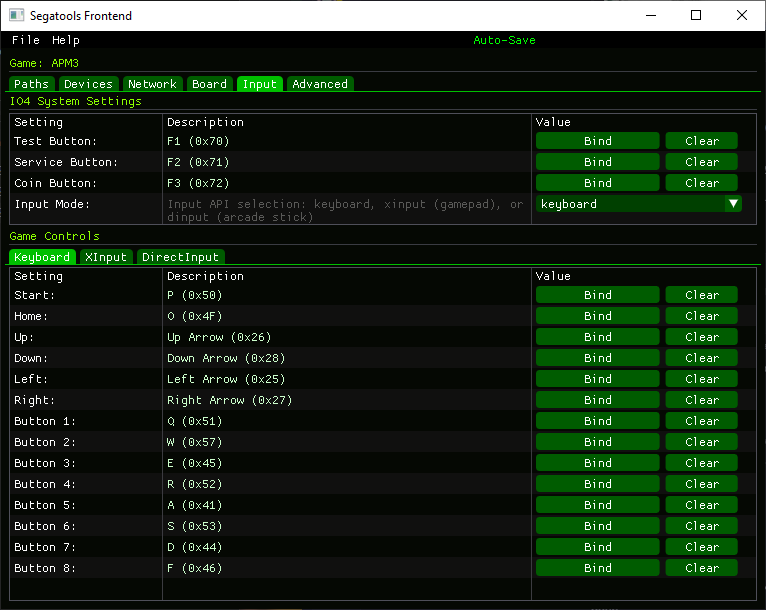

# Segatools-Frontend_Releases
For releasing the binaries

Currenly supported games/softwares

- APM3
- Mercury
- Mu3
- CM

## Some notes  
Since this project is still in an experimental phase, I highly recommend that you back up your `segatools.ini` before starting to use this front end.
  
## Screenshots

<table>
  <tr>
    <td></td>
    <td></td>
  </tr>
</table>

