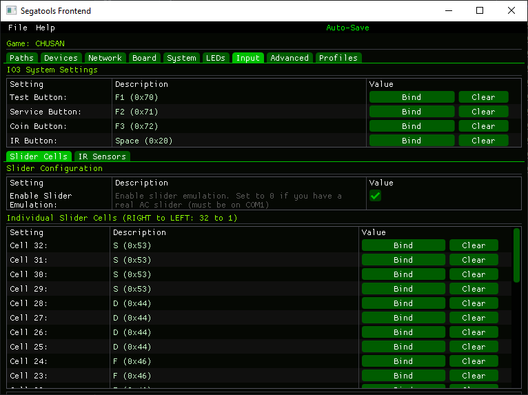
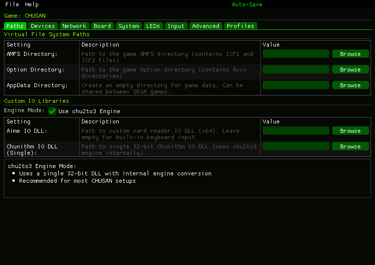
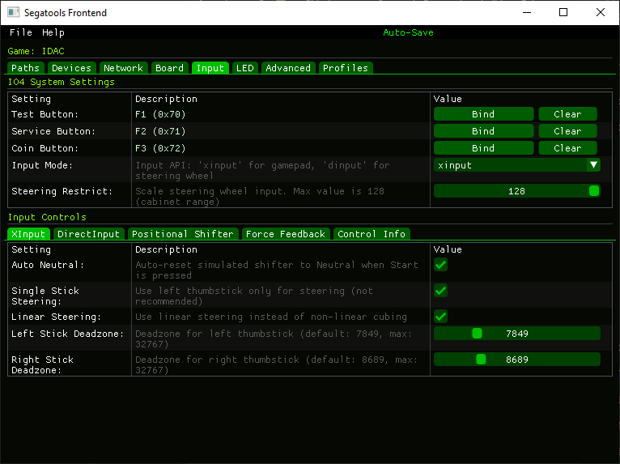
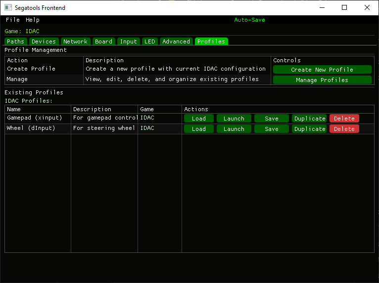

# Segatools-Frontend_Releases
For releasing the binaries

Currenly supported games/softwares

- APM3
- CAROL
- CM
- CXB
- Chuni
- Chusan
- DIVA
- FGO
- IDAC
- IDZ
- KEMONO
- MAI2
- Mercury
- Mu3
- SWDC
- TOKYO
  
## Some notes  
Since this project is still in an experimental phase, I highly recommend that you back up your `segatools.ini` before starting to use this front end.

## About the profile system
By default, profiles created in the graphical interface are saved in `%appdata%`. If you want the profile files to be stored locally, create a text file named `portable.txt` in the program's directory. This will make profiles save in the same folder as the application.

## Screenshots

### Chusan EX Configuration
<table>
  <tr>
    <td></td>
    <td></td>
  </tr>
</table>

### IDAC Configuration
<table>
  <tr>
    <td></td>
    <td></td>
  </tr>
</table>
